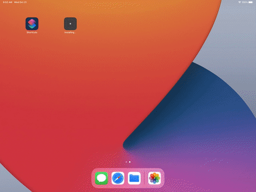

# Cloudy

A cloud gaming ready browser for iOS.

# Supported Features

- Right now opens stadia path automatically on first startup
- Supports Bluetooth gaming controllers
- Fullscreen support
- The following shortcuts in the address bar
  - `stadia` -> opens stadia
  - `gfn` -> opens geforce now
- If you want to go crazy, you can specify your custom user agent
- Reset all cookies and caches

# Features in development

- The following shortcuts for the address bar
  - `boost` -> opens boosteroid
- Touch controls to imitate the mouse
- Keyboard input
- Virtual controller

# Support the development

